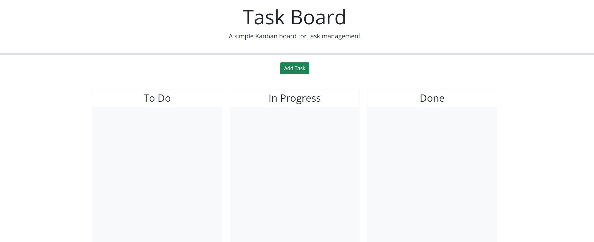

# Javascript Task Board

## Description
A simple kanban board made using JS, CSS, and HTML.

## Installation

N/A

## Usage
Open up https://larwis95.github.io/javascript-task-board/ in your browser. Create a task by clicking the add task button and filling out the form. You can move the tasks between 3 locations, to-do, in progess, and done. The card color changes based on a date breakpoint of default 5 days.

1. If > 5 days from due date the card will be green, or it will be green if its in the done list.
1. If <= 5 days but >= 0 from due date the card will be yellow
1. If < 0 days from due date the card will be red.

## Screen shot

## License

N/A